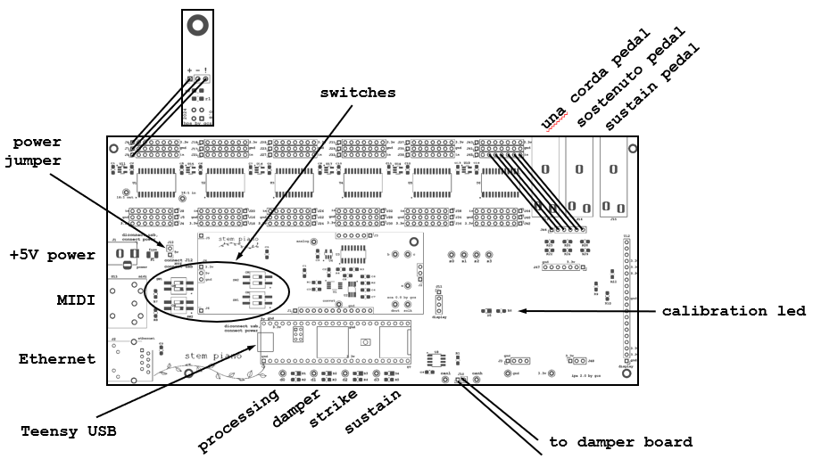
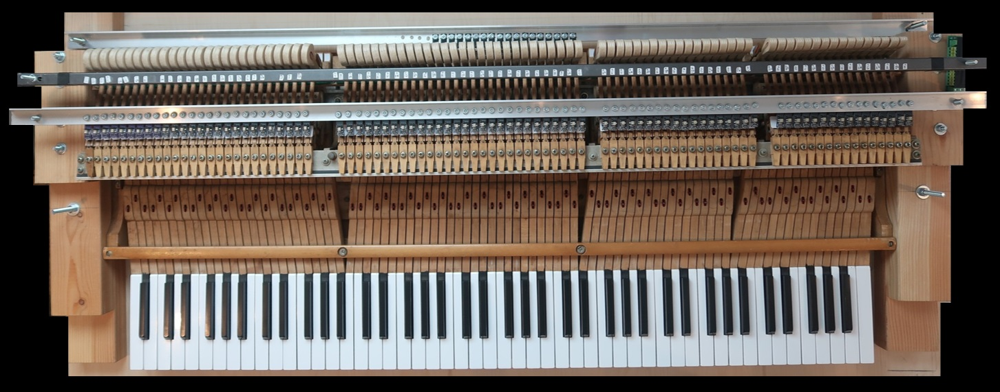
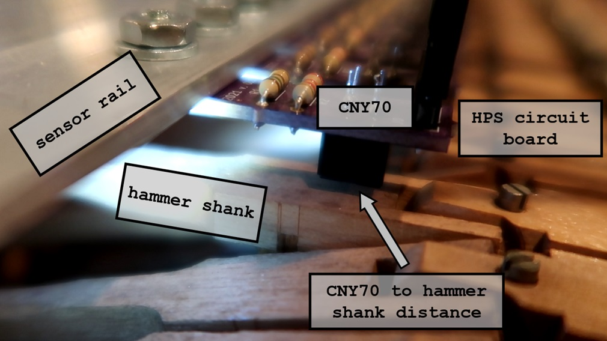
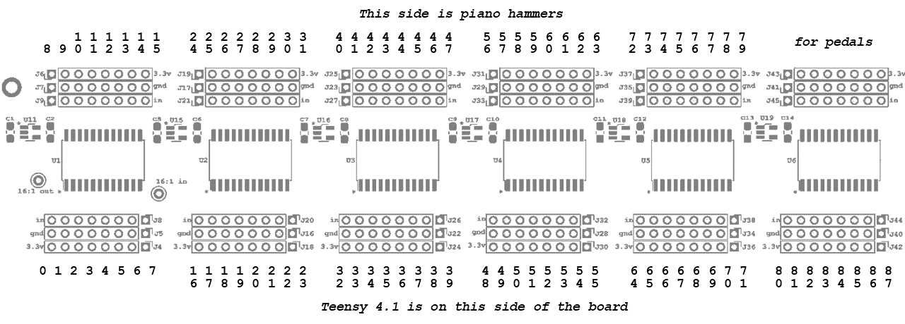
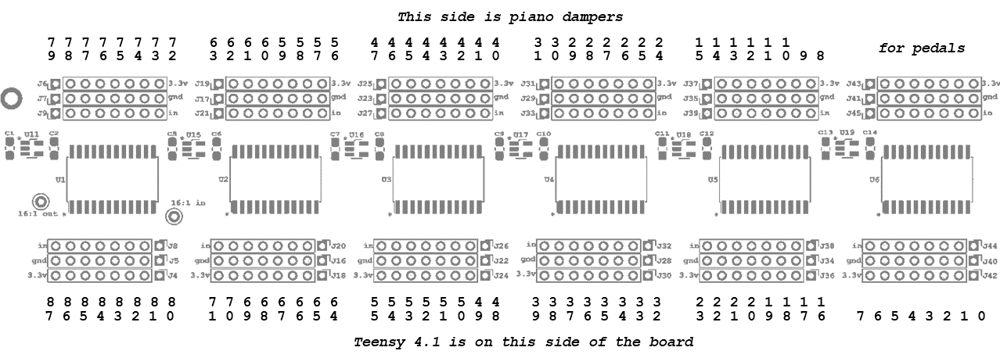
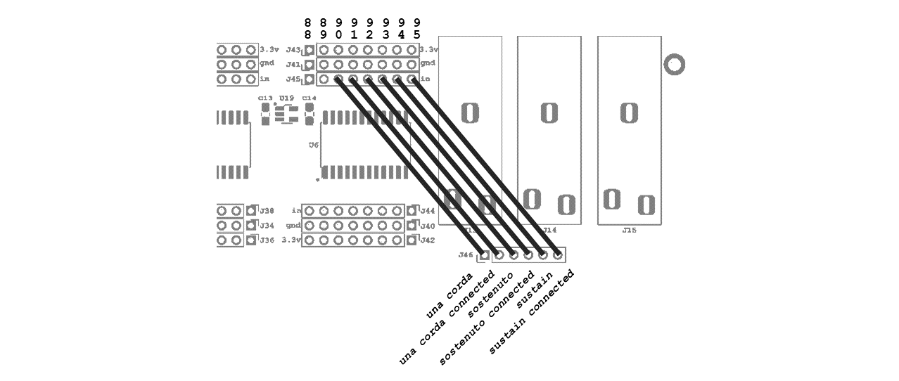

# Stem Piano G - Assembly Manual

Start here once have all components, accessories, cables, and a piano action (or invented some innovative alternative for the action).

The steps below are for a Grand Piano action.

If using an upright action or another musical idea (perhaps a new invention?) then the Grand Piano instructions give general guidance.

Video links in documentation below are to *stem piano* historical progress videos on YouTube: https://www.youtube.com/@gzpiano88. Useful for general ideas, not specific instructions.

## Circuit Board Overview

This figure shows the large Integrated Processing System (IPS) circuit board with the Six Channel Analog (SCA) circuit board installed. The SCA is the center rectangular board. To the left is a single Hammer Position Sensor (HPS) board with connections. A total of 88 HPS are required.

*Stem Piano* video description of circuit boards: https://youtu.be/NmziaIYKS1g?t=75

## Piano Action Frame

Build a frame that holds two (optionall three) bars. All must adjust vertically and horizontally.
* Hammer stop bar.
* Hammer sensor rail.
* Damper sensor rail (option).

Make the frame strong so does not move during piano playing.

Information on the frame: https://github.com/gzweigle/DIY-Grand-Digital-Piano/tree/main/mechanical.

Example piano action with hammer sensors, damper sensors, and hammer stop bar.

Example ideas from *Stem Piano* mechanical assembly videos:
* https://www.youtube.com/watch?v=5U7LvOMth28 (single-channel audio)
* https://www.youtube.com/watch?v=xohaQG593e4
* https://www.youtube.com/watch?v=ZMxMio3L9dk
* https://www.youtube.com/watch?v=w0TpXvcRCsM
* https://www.youtube.com/watch?v=NmziaIYKS1g

Build an enclosure (not shown) to keep all electronics isolated from contact. Vent for correct temperature range of electronics (instructions not provided).

## Hammer Stop Bar

Use a strip of firm material to absorb the force of shank against the bar. For example, weatherstripping works ok.

Position the hammer shank stop bar horizontally as close to each hammer as possible.

Adjust the hammer shank stop bar vertically until it is approximately 1/8" above the shank drop point. So, when pressing a piano key, move the key down slowly and adjust the bar so the hammer shank does not quite hit the stop bar. Try to get an even distance for all 88 hammer shanks.

See *stem piano* videos
* https://youtu.be/ANJI4KAolEw?t=86
* https://youtu.be/xohaQG593e4?t=48

## Hammer Sensor Rail

See *stem piano* video https://youtu.be/xohaQG593e4?t=60.

Drill 88 holes in the sensor rail. Each hole is located vertically above a hammer shank.

If holes are precise, they can match the machine screw diameter. Otherwise, make holes larger to give room for HPS horizontal adjustment.

Horizontally, the hole is such that the CNY-70 on the HPS is close to the place where the shank rotates on the pin adjacent to the drop screw. The shank may get wider at this location.

Install all 88 HPS sensors. The nut is on top. If put nut on bottom, it could hit the piano hammer shank.

Another option is aluminum extrusion. See https://github.com/stem-piano/stem-piano-g-main/issues/1

Adjust the sensor rail up and down until the hammer shank is between 0.5 millimeters 1.5 millimeter from the CNY-70 sensor when hammer hits the stop bar. If the distance is smaller than 0.5 millimeters, the CNY-70 response loses sensitivity. If the distance is larger than 1.5 millimeters, the output voltage can be too low. Better for a distance too large than too small.

The following picture shows the measurement location. In this picture there are no white stickers. For best results, use a white sticker or white paint on the hammer shank underneath the CNY-70 sensor.

Good note-to-note consistency depends on the consistency of shank-to-sensor distances for each sensor. It is a good idea to spend extra time making these distances as consistent as possible. One approach is using thin paper shims to adjust distances when connecting the sensors to the sensor rail.

If the hammer shank wood is not strongly reflective, place white stickers on each shank under the CNY-70 location. Another option is white paint. Use the same kind of surface as use in the CNY-70 voltage level tests: [./hps_testing.md](./hps_testing.md).

## Piano Action Regulation

For best results, get the piano action adjusted while in the configuration described above

Consistent shank height at sensor location.

## Connecting Hammer Sensors

Connect each HPS sensor to the correct IPS location using the ribbon cable.

Hammers are numbered starting at piano note A0 (key number 0), through piano note C8 (key number 87) in the first figure. Connect each set of three pins (power, ground, and signal) to the same three pins on each of the 88 sensors boards.

* Each HPS board is marked with a plus (+) symbol, a minus (-) symbol, and an exclamation point (!) symbol.

* The pins on the IPS board are market with a "3.3v" symbol, a "gnd" symbol, and an "in" symbol.

* Connect (+) to "3.3V", connect (-) to "gnd", and connect (!) to "in".

Connecting all the sensors is very time consuming. A total of 3*88 = 264 wires are required. Gluing into sets makes the connection process much easier. See *stem piano* video: https://youtu.be/gNeLMGaxmG0?t=103.

*Stem Piano* video showing wiring top view: https://www.youtube.com/watch?v=TemXGmkoc-g

## Connecting Damper Sensors (Optional)

A second IPS and SCA are required for damper sensors. Damper sensors are optional. If not using damper sensors, the damper location is estimated using the hammer sensors.

Damper keys are numbered starting at piano note A0 (0), through piano note C8 (87).

*Stem Piano* video showing damper wiring https://youtu.be/NmziaIYKS1g?t=167

## Connecting Pedal Header

This figure does not show the small extra PLS 0.0 circuit board (*future*).

Connect jumper wires (short ribbon cable will work) as shown in figure for the IPS mainboard connected to hammer sensors. While it is possible to also use the damper IPS mainboard for pedal connections, the firmware is not presently setup to support this option. Note that with both hammer and damper pedal connections, a total of 6 pedals could be available.

Three of the connection wires are optional (sustain connected, sostenuto connected, and una corda connected). Also, in many cases a sostenuto and una corda pedal are not used. Therefore, up to seven keys beyond the traditional 88 keys can be connected (total of 95 keys if using only a single pedal).

Pedal signals are not hardwired on the PCB. Therefore, these jumpers enable connecting pedals in many different configurations.

If noisy pedals or notes, connect unused pins to ground using a short segment of ribbon cable. For example, in this figure pins labeled 88 and 89 in the figure, on J45 (the 'in' row) connect to the adjacent ground pins on J41 (the 'gnd' row).