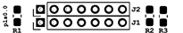

# Stem Piano G - Component Manual

List of piano components and accessories.

Video links in documentation below are to the *stem piano* historical progress videos on YouTube: https://www.youtube.com/@gzpiano88. Useful for general ideas, not specific instructions.

Component links in documentation below are to the original project repository: https://github.com/gzweigle/DIY-Grand-Digital-Piano.

## Overview of Major Components

This section overviews the major components. Links to code and hardware are provided in subsequent details sections.

### 1 - Mainboard
Name is the IPS for Integrated Processing System. *Stem Piano* uses version 2.0 of the IPS mainboard.

### 1 - Data acquisition board

Name is the SCA for Six Channel Analog. The data acquisition board removably attaches in the center of the mainboard. *Stem Piano* uses version 0.0 of the SCA data acquisition board.

Actual SCA size compared to IPS is smaller than shown in figure.

### 88 - Hammer sensor PCB

Named HPS for Hammer Position Sensor.

Each HPS sensor mounts above a piano shank, close to where the hammer shank connects to the hammer flange. Actual HPS size compared to IPS is smaller than shown in figure.

### 88 - Optional damper sensors PCB

Identical to HPS hammer sensor boards.

### 1 - Pedal Level Shift (PLS) PCB

Small circuit board to adjust the pedal voltage. See details section below. Actual PLS size compared to IPS is smaller than shown in figure.

### 3 - Sets of firmware.
* *StemPiano IPS2* - shared between hammer and damper processing.
* *Hammer Firmware* - unique to the hammer processing.
* *Damper Firmware* - optional - unique to the damper processing.

### 1 - Piano action or an innovative mechanical musical instrument interface.

## Sets of Major Compents Needed

Components when using one board to measure hammers and estimate dampers:
* 1 IPS 2.0
* 1 SCA 0.0
* 1 PLS 0.0
* 88 HPS measuring the hammer positions
* *StemPiano IPS2* firmware running on Teensy on IPS
* *Hammer firmware* running on Teensy on IPS
* Piano action

If using an additional system to measure dampers, add the following. This is a duplicate of the boards to measure hammers. The only difference is the damper firmware.
* 1 IPS 2.0
* 1 SCA 0.0
* 1 PLS 0.0
* 88 HPS measuring damper position
* *StemPiano IPS2* firmware running on Teensy on second IPS (this is the same firmware as for hammers).
* *Damper firmware* running on Teensy on second IPS (this is different than the hammer firmware).

It is possible to use different sensors instead of the HPS. See the HPS directories for interface specification.

The next sections provide more details of each component as well as a link to the component code or hardware files.

## Printed Circuit Board Details and Links

### Integrated Processing System (IPS) PCB

Link: https://github.com/gzweigle/DIY-Grand-Digital-Piano/tree/main/hardware/releases/ips20

In this directory are the files needed for PCB fabrication and a list of all components for the board.

The Teensy 4.1 processor removably connects to the IPS PCB.

### Six Channel Analog (SCA) PCB

Link: https://github.com/gzweigle/DIY-Grand-Digital-Piano/tree/main/hardware/releases/sca00

The six channel analog (SCA) card contains the data acquisition analog processing. This PCB removably connects to the IPS mainboard. In the SCA directory are the files needed for PCB fabrication and a list of all components for the board.

One SCA board per IPS board. For example, one SCA and one IPS together support 88 piano hammers. If processing dampers separately, then another SCA with another IPS support the 88 piano dampers.

### Hammer Position Sensor (HPS) Boards

Four options as listed below. It is ok to use multiple sensor versions in the same piano.

(1) HPS 0.8
* Link: https://github.com/gzweigle/DIY-Grand-Digital-Piano/tree/main/hardware/releases/hps08
* This is the recommended sensor circuit board.
* Surface mount
* No trimmer resistor
* Inexpensive

(2) HPS 0.7
* Link: https://github.com/gzweigle/DIY-Grand-Digital-Piano/tree/main/hardware/releases/hps07
* Not recommended for normal use cases.
* Surface mount
* Same as HPS 0.8 except with an added trimmer resistor
* Advantages:
    * Enables setting CNY70 output voltage closer to ADC maximum voltage which improves the dynamic range. Tests and analysis show this gives a tiny amount of incremental accuracy.
    * More flexible for a variety of piano action arrangements.
* Disadvantages:
    * More expensive.
    * Adjusting the trimming resistor is time consuming and difficult to set accurately.
    * The absolute maximum allowed current of an HPS is 14 mA. When adjusting the trimmer, must measure the current to make sure that it never exceeds 14 mA. The HPS 0.7 documentation (see link above) includes an example of test results for an HPS 0.7. The test results include current as function of trimmer resistor position for a randomly selected CNY70. These test results indicate that when the trimmer in its default position (100 ohms), the current is in the 12 mA range. Increasing the resistance (lowering the output voltage) decreases the current.
* With respect to current, if all HPS 0.7 trimmer resistors are set at 130 ohms, then the HPS 0.7 is equivalent to the HPS 0.8 (HPS 0.8: r1 = 180 ohms; HPS 0.7: r1=50 + r_trimmer=130 => 180 ohms). Approximately one full trimmer screw turn (360 degree) counterclockwise, from the default 100 ohm position, gets the resistor close to 130 ohms. Check with ohmmeter.

(3) HPS 0.4
* Link: https://github.com/gzweigle/DIY-Grand-Digital-Piano/tree/main/hardware/releases/hps04
* Same as HPS 0.8 except resistors are through-hole instead of surface mount.
* No trimmer resistor
* Inexpensive
* Easier to manually solder
* Looks cool

(4) Any sensor that meets interface requirements.
* The sensor boards must output an analog value in range [0, ..., 2.5] volts when the hammer or damper is furthest-from and closest-to the sensor respectively.
* It is ok to send a value less than 2.5 V. As low as 1.5 V should work. Lower voltages could require adjusting the settings in settings file.
* See the following file for a detailed explanation: https://github.com/gzweigle/DIY-Grand-Digital-Piano/tree/main/design/hps_cny70
* If powered by the IPS mainboard, the maximum allowable current draw of each sensor board is 14 mA.

### Pedal Level Shift (PLS) Board

Link: https://github.com/gzweigle/DIY-Grand-Digital-Piano/tree/main/hardware/releases/pls00

This small circuit board connects on top of pedal header J46. Adjusts the pedal voltage as explained in this logged issue - https://github.com/gzweigle/DIY-Grand-Digital-Piano/issues/26.

The piano will function without this board. The downside of not using this board is that the pedal voltage exceeds the maximum input voltage of the analog-to-digital converter (ADC) with respect to the voltage reference level.

Instructions for attaching PLS are in the *Assembly Manual*.

## Firmware and Software Details and Links

The following figure shows relationships between the firmware and software. The damper firmware and the analytics software are shown with dashed lines because they are optional.

### StemPianoIPS2 Firmware

Link: https://github.com/gzweigle/DIY-Grand-Digital-Piano/tree/main/firmware/releases/StemPianoIPS2

This is the Arduino library firmware that runs on the Teensy processor of the Integrated Processing System (IPS) mainboard hardware. Shared code for both hammer and damper processing.

Copy this code to the Arduino library location. If not using a separate damper board, then this firmware can be copied to the same directory as the hammer firmware.

### Hammer Firmware

Link: https://github.com/gzweigle/DIY-Grand-Digital-Piano/tree/main/firmware/releases/ips2_hammer

This is the main code for the Teensy 4.1 processor on the IPS mainboard hardware.
Use this code as the Arduino sketch code. May need to rename the top-level file extension from .cpp to .ino.

The settings file is located in this directory. The settings file controls all detailed configuration of the piano.

### Damper Firmware (Optional)

Link: https://github.com/gzweigle/DIY-Grand-Digital-Piano/tree/main/firmware/releases/ips2_damper

This is the main code for the Teensy 4.1 processor on the IPS mainboard hardware. When using a damper measurement system, a second IPS mainboard and second SCA card are required.

If the damper measurement system is not installed, the hammer firmware estimates the damper location based on the hammer sensor inputs. A switch controls whether using hammer or damper to get damper information.

### IPS2Analytics Software (Optional)

Link: https://github.com/gzweigle/DIY-Grand-Digital-Piano/tree/main/software/releases/ips2_analytics

Optional Python software for acquiring and displaying data from the Ethernet connection.
## Accessory Details (No Links)

### External +5 Volt Power Supply

Picture of an example:

Picture showing the +5 volt output next to the IPS barrel jack connector.

Requirements:
* At least 3.5 amp output capability when connecting to both the hammer and damper boards.
* At least 1.75 amp output capability when using a single board.
* Safety protection: overcurrent, short circuit, overvoltage, thermal limits, etc.
* Connects to a standard breadboard-style DC power input jack on the circuit boards.

### Surge Suppressor

The high voltage side of the external +5 volt power supply should connect through a surge suppressor to the higher voltage.

### External Power Switch

*Stem Piano* does not include a power switch. Use an external switch. Often a switch is integrated with a surge suppressor.

### External Damper Pedals

*Stem Piano* video explanation of the pedals and pedal requirements:
* https://youtu.be/9sqkgVXceJU?t=17

*Stem Piano* has been tested with the following pedals:
* Roland DP-10
* Roland RPU-3

The pedal inputs connect directly to analog-to-digital converters through the IPS circuit board. Therefore, with only firmware changes, it is possible to use any kind of pedal.

### A Table for the Piano Action

A strong table is required. For proper playing height, select a table that positions *stem piano* at the same height as an acoustic piano.

## Mechanical Details

### Sensor Rail

L-shaped aluminum solid angle. 1 inch each for the two sides and 1/8 inch thick. Thickness prevents sag in middle. Length is at least piano action width.

The aluminum rail should be as straight as possible.

Another option is aluminum extrusion. See https://github.com/stem-piano/stem-piano-g-main/issues/1

### Hammer Shank Stop Bar

Steel square tube. 3/4 inch sides and 1/16 inch thick. Length is at least piano action width.

The square steel hammer shank stop bar should be as straight as possible.

### Hammer Padding

Attach padding to the hammer shank stop bar. This is a firm rubber or foam strip that the hammer shank hits. Weatherstripping with self-adhesive tape can work.

### Piano Action Frame

Some mechanical system for:
* Supporting the sensor rail
* Supporting the hammer stop bar
* Fixing together the piano action, sensor rail, and hammer stop bar
* A means for vertical and horizontal adjustment of sensor rail and hammer stop bar

## Cables and Wires and Fasteners

### HPS to IPS Connecting Wires

Each connection needs 3 wires. Hammer sensors require 3 wires * 88 keys = 264 wires and damper sensors require another 264 wires.

* Standard breadboard ribbon cable will work.

* Keep the cables as short as possible.

* Keep the cables away from electrical noise sources such as the +5 volt power supply.

*Stem Piano* connection example video: https://youtu.be/gNeLMGaxmG0?t=103

### Hammer and Damper Board Connection

If using a separate damper board, two wires connect hammer and damper IPS boards together. Connect J10 on the hammer IPS board to J10 on the damper IPS board.

Can use standard breadboard ribbon cable.

### MIDI Cable

Connects to the 6-pin MIDI port.

If using a separate damper system, a separate MIDI connection to damper IPS board is not required.

### USB Cable to Teensy

The Teensy 4.1 shorts its USB power connection and its +5 volt power pin.

The PJRC Teensy 4.1 website gives details on how to modify a USB cable to remove the power wires: https://www.pjrc.com.

### Ethernet Cable

Optionally connect to hammer IPS board. If using a separate damper system, a separate Ethernet connection to damper IPS board is not required.

### HPS Fasteners to Sensor Rail

* 88 of the 6-32 x 3/8 inch machine screws if use a single washer. If use a washer on top and bottom of HPS then 6-32 x 1/2 inch machine screws.
* 88 of the No. 6 flat washers. If use a washer on top and bottom then double this number.
* 88 of the 6-32 hex nuts.