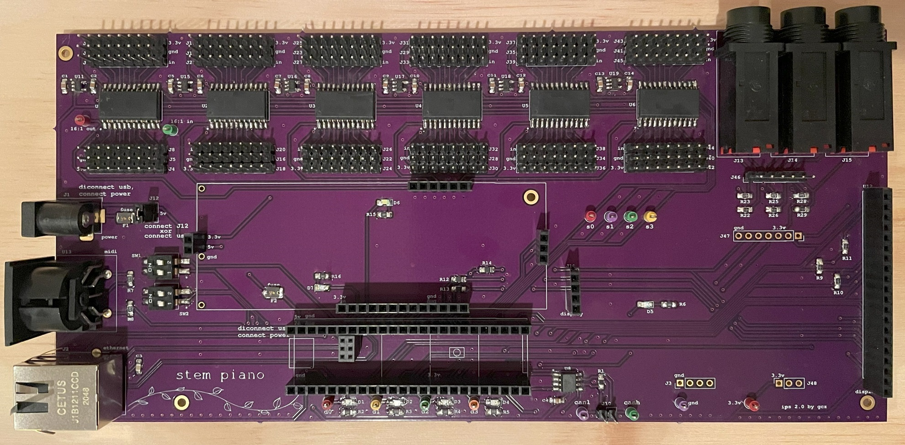
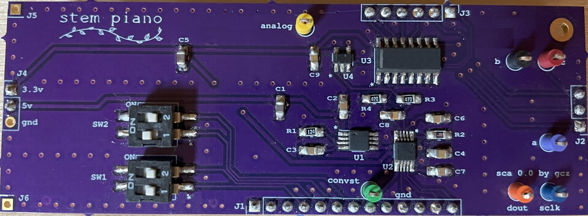
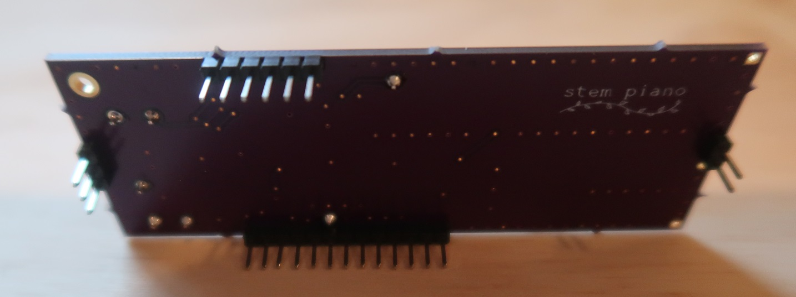
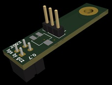
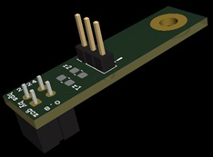
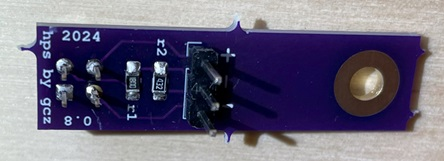
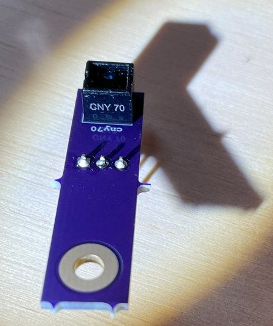
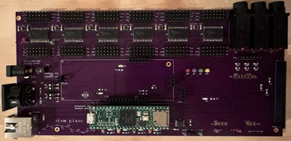
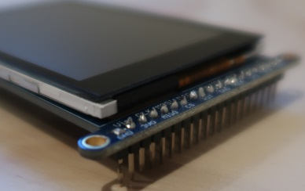

# Stem Piano G - Assembling Circuit Boards (Soldering on Parts)

This step is for an external manufacturer soldering all integrated circuits on the printed circuit boards.

Video links in documentation below are to the *stem piano* historical progress videos on YouTube: https://www.youtube.com/@gzpiano88.

## Part numbers

Most parts are listed with part numbers in the parts files list below. Some parts are listed but without part numbers. Examples:
* Colored LEDs
* 0.1-inch standard headers
* +5 volt barrel jack input
* MIDI connectors.

For the LEDs, select a type/color and add the part number. For the other parts, work with the board assembly manufacturer or purchase and send to the manufacturer.

For resistors and capacitors, it is probably ok to substitute reasonably close, or better, equivalents. Make sure to check the associated integrated circuit data sheet.

## Select a manufacturer to install the components

Work with the manufacturer on parts acquisition.

The manufacturer may supply some parts such as integrated circuits, resistors, and capacitors.

Some parts may need ordering separately such as the MIDI connector or pedal quarter-inch jack inputs.

## Solder parts on the IPS board

Parts File: https://github.com/gzweigle/DIY-Grand-Digital-Piano/blob/main/hardware/releases/ips20/ips20_bill_of_materials_0.txt

Ethernet is optional. If using Ethernet:

* The 2x3 pin 2mm header is **manually** soldered onto the Teensy. See *stem piano* videos:
  *  https://youtu.be/M1_228-ClXM?t=182.
  *  https://youtu.be/tyN7v7L9VIQ?t=51
* One of the two 2x3 pin 2mm socket headers is not soldered in place. It is stacked on the other. See same video for example.
* If unsure about these steps, it is ok to skip Ethernet. *Stem Piano* works without Ethernet. Can add later anytime.

## Solder parts on the SCA board

Parts File: https://github.com/gzweigle/DIY-Grand-Digital-Piano/tree/main/hardware/releases/sca00

In the following figure only a two-wide connector under J4 was used, not a three-wide. Note the associated header in IPS picture above. This means that the ground pin on J4 is not connected. This was because the SCA board has two ground points, one on J4 and one on J1. For this board, the ground on J1 is sufficient and provides a single ground return point.

Also, J5 and J6 are optional support pins. These were not needed and not soldered into place on this board.

At the upper right is a screw hole for an optional mounting screw.

The pin headers are on the bottom of the board. The headers are for connecting to the IPS. See *stem piano* video https://youtu.be/NmziaIYKS1g?t=100.

## Solder parts on the 88 HPS boards

88 boards are required.

HPS 0.8 - Parts file without an adjustable resistor and using surface mount components. Link: https://github.com/gzweigle/DIY-Grand-Digital-Piano/tree/main/hardware/releases/hps08

HPS 0.7 - Parts File with an adjustable resistor and using surface mount components. Link: https://github.com/gzweigle/DIY-Grand-Digital-Piano/tree/main/hardware/releases/hps07.

HPS 0.4 - Parts File without an adjustable resistor and using through-hole components. Link: https://github.com/gzweigle/DIY-Grand-Digital-Piano/tree/main/hardware/releases/hps04

HPS 0.8 is recommended for normal use cases.

Make sure the CNY70 and pin headers are oriented properly with respect to top and bottom of the boards. See *stem piano* video https://youtu.be/C9174TC4kLs?t=162.

Here is an image of the CNY70 and pin headers for the HPS 0.7 board and HPS 08 board. Resistors are not shown in images.

Top side of HPS 0.8 with components installed:

Bottom side of HPS 0.8 with components installed:

Notice the orientation of the CNY70. The "CNY70" marking area on the CNY70 is on the same side as the "cny70" label on the HPS circuit board.

The resistor values in the bill of materials are selected assuming a white reflective surface.

## Solder parts on the PLS board

Instructions *coming soon*.

## Install the Teensy 4.1

Purchase a Teensy that includes pins

Before installing:

* Cut the 5V pad on Teensy 4.1 per instructions at PJRC website before installing the Teensy processor. https://www.pjrc.com/teensy/external_power.html

* See: https://github.com/stem-piano/stem-piano-top/blob/main/WARNINGS.md

* *stem piano* video example (please verify with PJRC website) - https://youtu.be/tyN7v7L9VIQ?t=27

* After the 5V pad on Teensy 4.1 is cut, install jumper J12 on the IPS circuit board. This jumper is located at the left of the circuit board, next to the +5V power input connector.

The Teensy is socketed. It should snap into place.

## Connect IPS and SCA

Connect the SCA board to the IPS board. It should snap into place.

See *stem piano* video https://youtu.be/NmziaIYKS1g?t=105.

## Install the PLS PCB

Instructions *coming soon*.

## Install the 2.8 inch TFT display

This is an optional step.

*Stem Piano* works without a TFT installed.

May need to solder pins onto the TFT. See figure:

The TFT is socketed. It should snap into place on the IPS mainboard.

*stem piano* video showing top corner modification for fit: https://youtu.be/tyN7v7L9VIQ?t=149

Install the 2.8" TFT unmodified. The TFT IM1, IM2, and IM3 pins are connected to +3.3V on the IPS 2.X PCB. Therefore, these jumpers internal to the TFT should *not* be soldered together (the manufacturer website may describe soldering them together).