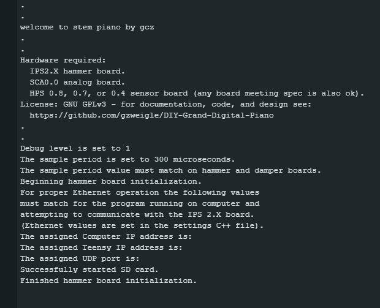

# Stem Piano G - Initial Testing

Video links in documentation below are to the *stem piano* historical progress videos on YouTube: https://www.youtube.com/@gzpiano88.

The following instructions are for an IPS circuit board with the hammer firmware.

Here is a *stem piano* video with an example of initial testing before connecting to a piano action. The video shows a test sequence similar to the instructions below. https://youtu.be/tyN7v7L9VIQ?t=100

## Setup

The piano action and frame are not required for this step.

Make sure all DIP switches on IPS2 are in their off position. If switches were not installed, this step is not necessary.

Power connections:

* Cut the 5V pad on Teensy 4.1 per instructions at PJRC website before installing the Teensy processor. https://www.pjrc.com/teensy/external_power.html

* See: https://github.com/stem-piano/stem-piano-top/blob/main/WARNINGS.md

* *stem piano* video example (please verify with PJRC website) - https://youtu.be/tyN7v7L9VIQ?t=27

## Connect a single HPS board

### Check HPS Voltages

Before connecting the HPS, verify correct voltage level following this procedure: [../hps_testing.md](../hps_testing.md)

### Connect a single HPS board

For simple initial test, connect a single HPS board to the IPS board.

Each HPS board is marked with a plus (+) symbol, a minus (-) symbol, and an exclamation point (!) symbol.

The pins on the IPS board are market with a "3.3V" symbol, a "gnd" symbol, and an "in" symbol.

Select the triplet of pins on the IPS board that are closest to the +5V power input and connect (+) to "3.3V", connect (-) to "gnd", and connect (!) to "in". The connection in this initial test is for the lowest note on a piano, A0. It is data index 0 in the firmware.

Modify the firmware settings to disable unused inputs.

## Connect USB to Teensy and power up

Connect a USB cable to the Teensy.

Connect the opposite side of the USB cable to a computer.

Power up the IPS, SCA, and a single HPS board.

## Download

Please follow steps in the [../firmware_downloading.md](../firmware_downloading.md) manual. Then return to this step.

If LED are installed on the IPS circuit board, they should begin blinking.

Optionally measure the voltage at the 3.3 volt pin on lower right of IPS board with a multimeter to check that it reads 3.3 volts.

If no LED are not blinking or no voltage is measured, disconnect USB cable from computer and see the https://github.com/gzweigle/DIY-Grand-Digital-Piano/blob/main/HELP.md file and also the https://github.com/gzweigle/DIY-Grand-Digital-Piano/issues.

## Test it works?

Open a serial monitor in Arduino. A set of startup messages should display from the firmware running on the Teensy.

Example startup message:

Use a rectangle of white cardboard and try to "play a note" by quickly moving the cardboard toward the CNY70 sensor. See *stem piano* video https://youtu.be/NmziaIYKS1g?t=115. A message should appear in the Arduino serial monitor that a note was sent to MIDI.

If the serial monitor is not displaying anything, the problem could be with any of:
* a PCB board
* the Arduino serial connection
* bad cable or connection
* serial monitor window was opened after the message displayed
* the *debug_level* in settings file is not set to display information

## Test with a MIDI cable

Power down.

Connect a MIDI cable from IPS to a computer.

Run software on an external computer that converts MIDI to sound. Before using with *stem piano*, check that the external software is working by using an existing MIDI keyboard or source.

Turn the speaker volume to a low level.

Power up.

"Play the note" again. Using the cardboard. Should hear a sound.

## Celebrate, just a little

If at this step, congratulations. See *stem piano* video https://youtu.be/M1_228-ClXM?t=321.

Test other HPS boards and other IPS input pins. Test several simultaneously.