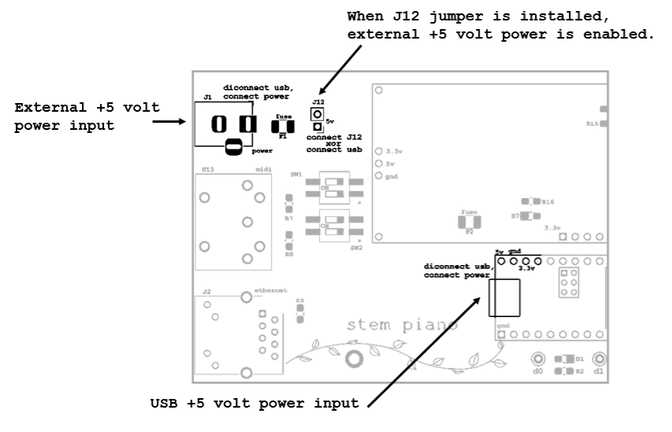

# Stem Piano G - Firmware Downloading

## USB Cable And +5 Volt Power - The Problem

A USB cable connects from an external computer to the Teensy 4.1 processing system.

The USB cable has two purposes:
- Send firmware from computer to the Teensy 4.1
- Serial monitor connection.

Also, it can provide +5 volt power from an external source such as a computer.

## USB Cable And +5 Volt Power - Solution

* Cut the 5V pad on Teensy 4.1 per instructions at PJRC website before installing the Teensy processor. https://www.pjrc.com/teensy/external_power.html

* See: https://github.com/stem-piano/stem-piano-top/blob/main/WARNINGS.md

## Initial Download

When initially downloading firmware to the Teensy, may need to push the download button on the Teensy.

## Strategy When Using Hammer and Damper Boards

If running Arduino software for both hammer and damper Teensy simultaneously, use the serial monitor to keep track of which USB is connected to each Teensy. The serial monitor can display the Teensy connection.