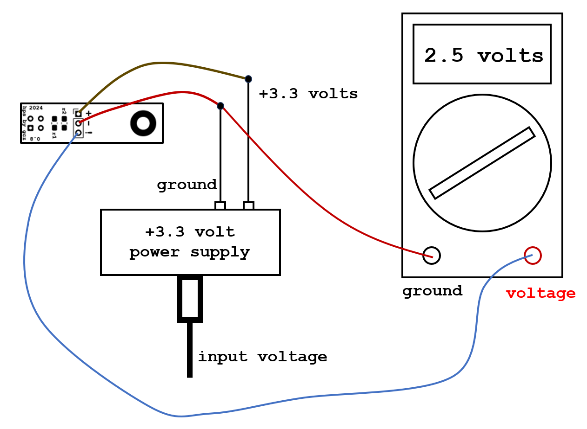
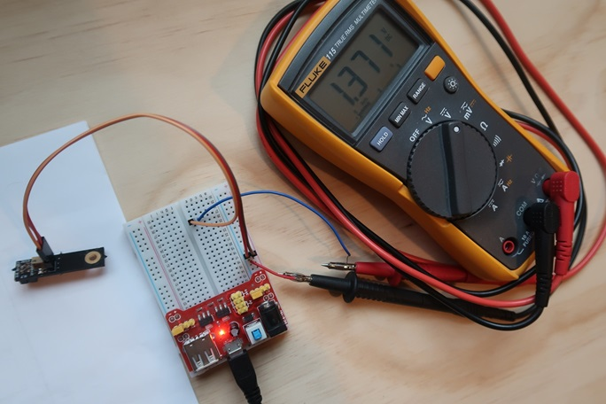

# Stem Piano G - HPS Testing

Unless additional debugging is required, this is the only step that requires measuring voltages.

The purpose of this step is to verify the correct output voltage range of the HPS sensors.

For best results, test all 88 hammer sensors and all 88 damper sensors. This will take a long time. Therefore, it is ok to sample a few of the sensors and assume the others are similar. A small sample set runs the risk of missing a problem.

## Test Setup

### Block Diagram

Connect a test system as shown in figure.

On the right is a digital multimeter. To the left is an HPS sensor board. In the middle is a simple low-cost, USB based voltage source.

### Test Setup Components

* HPS sensor.

* +3.3 volt power supply. The current required is very low. Therefore, an inexpensive USB breadboard power supply will work.

* Multimeter. The multimeter is set to measure DC voltage.

* White paper. It is important to use the same kind of material on the hammer shanks as use for this test. This is because the HPS sensor output voltage depends on the reflective surface. If use a different surface in the piano, then the test results will not match the results when in the piano.

### Connections

(+) The power input of the HPS connects to +3.3 volts.

(-) The ground input of the HPS connects to the power supply ground.

(!) The signal output of the HPS connects to the voltage input of the multimeter.

The multimeter ground connects to the power supply ground.

## Picture of Setup

In this picture the output voltage reads 1.371 volts. The voltage is not 2.5 volts because notice in the picture that the HPS sensor is partially distant from the white paper.

## The Test Instructions

Move the CNY-70 on the HPS PCB close to a white sheet of paper and then move it away from the white sheet of paper.

When the CNY-70 on the HPS PCB is close to the paper, the multimeter DC voltage display should show a maximum value close to 2.5 volts. Move the PCB until a maximum value is shown on the display. The maximum value should not exceed 2.5 volts.

When the CNY-70 is a large distance from the paper, the multimeter DC voltage display should show a value close to 0 volts.

Acceptable ranges:
* For the larger voltage (small distance), anything between 1.5 volts and 2.5 volts is ok.
* For the smaller voltage (large distance), anything between 0 volts and 0.3 volts is ok.

Not all CNY-70 sensors are the same. Some will have larger voltages during the test and some will have smaller voltages during the test. This is expected and is ok.

## What if the smaller voltage (large distance) is above 0.3 volts?

If some of the smaller voltages (large distance) for measured HPS sensors are too large, it could require changing the damper threshold in settings. See the *Firmware Manual* for instruction on changing settings [./firmware_manual.md](./firmware_manual.md).

## What if the larger voltage (small distance) is below 1.5 volts?

If some of the maximum voltages (small distance) for measured HPS sensors are too small, it could require changing the settings threshold in settings. See the *Firmware Manual* for instruction on changing settings [./firmware_manual.md](./firmware_manual.md).

## What if the larger voltage (small distance) is above 2.5 volts?

A voltage higher than 2.5 volts cannot be fixed by settings changes. This is because of the distortion due to analog-to-digital converter (ADC) clipping.

Options:
* Try a less reflective surface. For example, a grey color piece of paper. Then, use a similar surface (such as a colored sticker) attached to the piano shanks or damper piano action location.
* Make the sensor-to-shank distance larger when installing the sensor rail.
* Change the resistance values on the HPS. See link in next section below for details.

## Details

For a detailed analysis of the HPS design and voltages, including how resistor values were selected, see https://github.com/gzweigle/DIY-Grand-Digital-Piano/blob/main/design/hps_cny70/hps_cny70.md.

# PREVIOUS STEP
[./construction_manual.md](./construction_manual.md)

# NEXT STEP
[./assembly_manual.md](./assembly_manual.md)