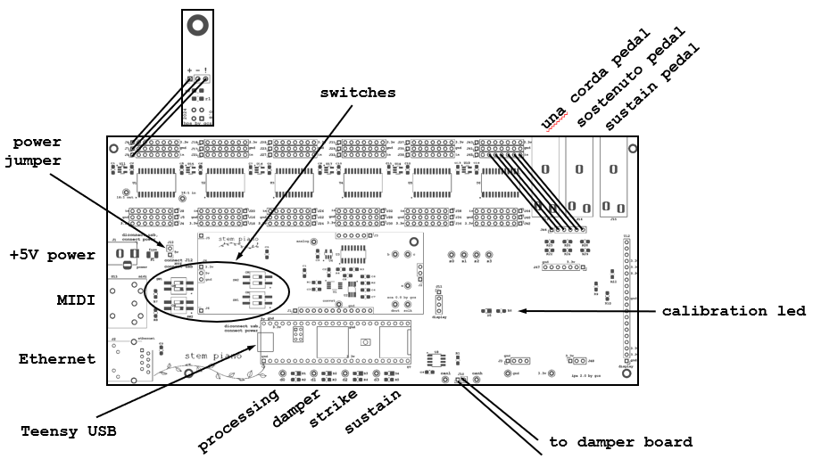

# Stem Piano G - Users Manual

Manual for use of Stem Piano G after assembly is complete.

## Quick Start Guide Without Damper Board

For easiest quick start, first get the system working without a separate damper board. Add the damper board later.

The following figure shows the connections and main components for *stem piano*. The 2.8 inch TFT display is not included in the figure.

The quick start setup does not include an Ethernet connection or TFT display option.

1. Turn all switches to the OFF position. If switches were not soldered onto the board, the default value is OFF.

2. Connect a sustain pedal to quarter inch connection as shown in figure top right.

3. Connect a 6-pin serial MIDI cable from the *stem piano* to a computer.

4. Run MIDI-based software sound synthesizer software on computer.

5. Connect computer to speakers. Turn on speakers.

6. Connect the +5V power connection to the *stem piano*. Because *stem piano* does not have a power switch, put the power connection on an external switch.

7. Turn on the power switch.

8. Wait until LEDs on the board being blinking. The delay is approximately 5 seconds.

9. Play piano!

## Teensy USB

During normal operation, the Teensy USB is not required and should not be connected. See [./firmware_downloading](./firmware_downloading.md) for information on the USB cable.

## Configuration Switches

Move switch position with a thin wood or plastic utensil. Use something nonconductive.
* Moving switch to right is OFF
* Moving switch to left is ON

The state of an uninstalled switch is OFF. The piano is in normal state with all switches in the OFF position.

### ips_sw1_position2 (DAMPER_THRESHOLD)
* Upper left switch next to MIDI connector on the IPS circuit board.
* OFF = Normal damper threshold.
* ON = High damper threshold.
* Normally in the OFF position
* Can use to debug dampers not releasing.

### ips_sw1_position1 (EXTERNAL_DAMPER_BOARD)
* Below ips_sw1_position2
* OFF = No damper board. Dampers are estimated from hammer position.
* ON = The optional external damper board is connected. Damper position is measured by the damper board and then sent to the hammer board.

### ips_sw2_position2 (ENABLE_ETHERNET)
* Below ips_sw1_position1.
* OFF = Ethernet is disabled. No Ethernet cable is needed.
* ON = Ethernet is enabled. Piano will not function unless an Ethernet cable is connected.

### ips_sw2_position1 (ENABLE_TFT)
* Below ips_sw2_position2.
* OFF = TFT displays default message. Normal piano operation.
* ON = TFT displays maximum hammer position and other diagnostic information. MIDI is disabled. Piano does not play sound.

### sca_sw2_position2 (UNUSED)
* Upper switch on SCA card.
* Not used.

### sca_sw2_position1 (DYNAMIC_VELOCITY_SCALING)
* Below sca_sw2_position2.
* OFF = Only apply the static velocity scaling. Do not apply an additional dynamic scaling.
* ON = In addition to the static scaling, also apply a dynamic scaling.

### sca_sw1_position2 (FREEZE_CAL_VALUES)
* Below sca_sw2_position1.
* OFF = Calibration values are updated while piano is played. See below.
* ON = Calibration values are frozen.
* OFF->ON = When move switch from OFF to ON, the present calibration values are stored into nonvolatile memory.
* ON->OFF = No effect on nonvolatile memory.

### sca_sw1_position1 (DELETE_CAL_VALUES)
* Below sca_sw1_position2.
* OFF = Calibration values are applied to signals normally.
* ON = Disable calibration. No calibration values are applied to signals. Most likely the volume will be uneven. See below.
* OFF->ON = When move switch from OFF to ON, the calibration values in nonvolatile memory are deleted. Powering up with switch off may not delete.
* ON->OFF = No effect on nonvolatile memory.

## Dynamic Velocity Scaling

The piano measures hammer velocity in meters per second. Hammer velocity ranges from 0 to 5 (or higher) meters per second. This velocity must be converted to a MIDI value in range 0 to 127. Each piano action along with the *stem piano* mechanical structure is unique and will exhibit slightly different velocity ranges.

In the settings file is a conversion factor. This conversion factor is always applied when converting meters per second to MIDI values.

Additionally, *stem piano* can apply an optional dynamic scaling factor when the DYNAMIC_VELOCITY_SCALING switch is ON.

The dynamic velocity scaling factor is computed along with other calibration values as described below.

## Velocity Curve

The *stem piano* firmware computes velocity as the continuous derivative of hammer shank position. The firmware makes no curve adjustments. In the future velocity adjustability may be added (*FUTURE*). Until then, use external MIDI software to fine-tune the velocity curve. Here is an example:

| input MIDI velocity | output MIDI velocity |
|---------------------|----------------------|
| 0                   | 0                    |
| 16                  | 8                    |
| 29                  | 18                   |
| 41                  | 29                   |
| 53                  | 43                   |
| 70                  | 64                   |
| 88                  | 88                   |
| 105                 | 110                  |
| 117                 | 121                  |
| 127                 | 127                  |

A velocity curve that sounds good has dependencies to the velocity dynamic range results.

## Calibration

### Overview

Each *stem piano* mechanical structure, along with the piano action, is unique and exhibits a slightly different response as seen by the sensors. Additionally the sensors and other *stem piano* electronic components can introduce variability.

During calibration the *stem piano* firmware measures the maximum and minimum sensor output values and applies those values to calibrate the position and (optionally) velocity values in real time.

Without calibration, the piano will likely sound uneven when playing. This is similar to the situation of a poorly voiced piano. Some notes may not make any sound.

### Calibration Control with Switches

When sca_sw1_position2 (FREEZE_CAL_VALUES) and sca_sw1_position1 (DELETE_CAL_VALUES) switches are both OFF, the *stem piano* firmware continuously measures hammer positions, velocities, updates the calibration values, and applies calibration values to received signals.

When sca_sw1_position1 (DELETE_CAL_VALUES) switch is ON:
* Calibration is disabled.
* Position and velocity calibration values stored in nonvolatile memory are deleted.

When sca_sw1_position2 (FREEZE_CAL_VALUES) switch is ON:
 * The position and velocity calibration values are frozen and do not update.
 * The position and velocity calibration values in nonvolatile memory are re-applied when power is cycled or when new firmware is downloaded.

LED under the TFT:
* When all position calibration values are at default the LED flashes quickly.
* When sca_sw1_position1 (DELETE_CAL_VALUES) is ON, the LED flashes quickly.
* When a calibration value is applied to all 88 keys, the LED flashes slowly.
* When calibration values are written to EEPROM the LED temporarily stops flashing and is ON.
* Velocity calibration values are accurate after all position measurements include position calibration corrections. Therefore, velocity calibration values are only computed while the LED is flashing slowly.

### Calibration Best Results
* Turn OFF sca_sw1_position1 (DELETE_CAL_VALUES).
* Power up the piano.
* Turn ON sca_sw1_position1 (DELETE_CAL_VALUES) then turn it OFF. This ensures old values are deleted from nonvolatile memory.
* Firmly play each piano note once.
* Repeat.
* Turn ON sca_sw1_position2 (FREEZE_CAL_VALUES) to freeze calibration values and store them in nonvolatile memory.
* After the above steps are completed, turn ON sca_sw2_position1 (DYNAMIC_VELOCITY_SCALING) if need the dynamically calculated velocity calibration value. If the fixed velocity calibration value in the settings file is sufficient then the dynamic velocity scaling is not needed.

### Calibration Debugging
* Any excessively bad sensors might not calibrate correctly. An example is a sensor with a very low HPS output voltage when distance is small. See [./hps_testing.md](./hps_testing.md) for valid voltages.
* Any sensors with excessively large voltages may calibrate correctly but then not restore calibration values after a power cycle correctly due to clipping. See [./hps_testing.md](./hps_testing.md) for valid voltages.
* If the piano does not play evenly, try repeating the calibration process.
* For best results, calibrate with minimal ambient light. See *stem piano* video https://youtu.be/TemXGmkoc-g?t=150 for a lighting issue example.

If the sensor placement is changed, repeat the calibration process.

## Front LEDs / Test Points

At the front of the piano, next to the Teensy, are four LEDs. Each LED is electrically connected to a test point. The firmware drives with a Teensy pin. Here is the functionality, using names from figure above:

### processing

This test point is high during Teensy main loop processing. The rate is very high and so the LED may be solidly or dimly illuminated. Can monitor with an oscilloscope for debug.

### damper

This LED is ON when any damper is raised by pressing and holding a piano key.

Normally this LED is OFF when no piano keys are pressed. If LED is ON when no piano keys are pressed, this indicates:
* the *damper_threshold_low* or *damper_threshold_high* setting is incorrect or
* a sensor problem or
* not all notes have calibration values (in this case the calibration LED is flashing quickly) or
* distances from sensors to hammer shanks are not uniform between keys.

### strike

This LED is ON when any hammer is close to the string. When a single piano key is pressed quickly, this LED should briefly turn ON then OFF.

Normally this LED is OFF when no piano keys are pressed. If LED is ON when no piano keys are pressed, this indicates:
* the *strike_threshold* setting is incorrect or
* a sensor problem or
* not all notes have calibration values (in this case the calibration LED is flashing quickly) or
* distances from sensors to hammer shanks are not uniform between keys.

### sustain

This LED is ON when any of the pedals is pressed. Probably should be called 'pedal' and not 'sustain'.

## Other LEDs

There are two LEDs under the SCA and two on the Ethernet connector.

The SCA LEDs flash at a fixed rate. They are available for firmware customization.

One Ethernet LED flashes when data is transferred. The other flashes at a fixed rate and is available for firmware customization.

## Communications

### Serial Monitor

Multiple categories of information are displayed through the Arduino serial monitor. See firmware code for details.

### Ethernet

Every instant that the analog-to-digital converter (ADC) samples the hammer shank positions, 12 hammer position values are sent over Ethernet.

The values are after normalization and after calibration.

The values are integers in range [-2^23, ..., 2^23].

Select which 12 hammer shank positions are sent as follows:
* Press and hold a single piano key.
* Depress and release the sustain pedal.
* Release the piano key.
* The values for the held piano key along with the 11 subsequent key values are sent.

Example software for receiving the 12 values over Ethernet:
https://github.com/gzweigle/DIY-Grand-Digital-Piano/tree/main/software/releases/ips2_analytics

## If Add A Damper Board (optional)

The optional damper board and damper sensors measure the back of each piano key. If not using a damper board, the damper positions are estimated from the hammer positions.

The MIDI connection on damper board is not used. All MIDI data is through the hammer board.

The damper board requires a separate +5 volt input connection.

The damper board Teensy processor is programmed separately from the hammer board Teensy processor.

The damper board has its own 2.8 inch TFT display.

The configuration switches, LEDs, and test points are different on the damper IPS, compared to the hammer IPS.

## Caring for Stem Piano

The CNY70 have a long, but finite lifetime.

Turn off piano when:
* Not in use.
* Changing any connections.

Protect the circuit boards from electrostatic discharge (ESD) and anything touching them. Build a case or enclose the piano. The circuit boards generate some heat and should be vented.

If the frame is moved it could change the sensor alignment. In this case, clear the calibration values and restart the calibration and velocity processes.

Enjoy!

## Changing Firmware and Software

Now even more fun begins.

You have an open source piano and can add any features and be as creative as you wish.

See the firmware/software manual for details on firmware and firmware settings: [./firmware_manual.md](./firmware_manual.md)

## Important Resources

* Please read the warnings and limitations: https://github.com/gzweigle/DIY-Grand-Digital-Piano/blob/main/WARNINGS.md

* Help it doesn't work: https://github.com/gzweigle/DIY-Grand-Digital-Piano/blob/main/HELP.md

* Active problems, bugs, and lists of future enhancements:
    * https://github.com/gzweigle/DIY-Grand-Digital-Piano/issues 
    * https://github.com/stem-piano/stem-piano-g-main/issues

## Users Manual, Select Change History
* Add storing calibration values.